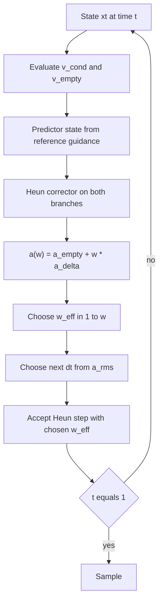

# Experiment Report: Curvature-Aware OT Flow Matching

**Date:** 2026-09-22  
**Repo:** [michaelbazkor/Generative-Learning-Project](https://github.com/michaelbazkor/Generative-Learning-Project)  
**Sources:** [`docs/proposal.pdf`](docs/proposal.pdf), [`docs/experiment_plan.pdf`](docs/experiment_plan.pdf), [`docs/theory.md`](docs/theory.md)

## Goal (fixed)

Test whether **local trajectory acceleration** $a_t = dv_t/dt$ is a trustworthy, **training-free** signal to co-adapt ODE step sizes and Classifier-Free Guidance (CFG) scales in Optimal Transport Conditional Flow Matching (OT-CFM), especially at low step counts and high guidance.

The written experiment plan was treated as a **hypothesis set**. Datasets, couplings, norms, step laws, and damping laws were scrutinized theoretically and empirically before being locked.

## Sampler flow



Identity tests: `python tests/test_identities.py` (7/7 passed).

---

## Stage 0 — Theory inconsistencies in the plan

| Issue | Plan text | Theory correction | Decision |
|---|---|---|---|
| Acceleration | Proposal: $\partial_t v$ at fixed $x$. Plan: Heun pair along the path. | Particle accel is the **material** derivative $\partial_t v + (\nabla v)\cdot v$. Heun FD matches it up to $O(\Delta t)$. | Prefer Heun (verified Stage 2). |
| Coupling | OT-CFM loss with independent $x_0,x_1$. | Independent conditionals cross; curved marginal even for a perfect net. True OT needs (mini)batch matching. | Test both (Stage 1). |
| Step law | $\Delta t=\eta/(\Vert a\Vert+\varepsilon)$ ($p=1$). | Euler local error $\propto (\Delta t)^2\Vert a\Vert$ needs $p=1/2$. Use RMS $\Vert a\Vert_2/\sqrt{d}$. | Test $p\in\{1,1/2,1/3\}$ vs uniform (Stage 3). |
| Guidance | $w/(1+\gamma\Vert a\Vert)$, norm not squared. $a$ depends on $w$. | CFG is affine, so $a(w)=a_{\emptyset}+w\cdot(a_c-a_{\emptyset})$ from cached branches. $w^{\star}=\mathrm{clip}(w_{+},1,w_{\max})$ is the larger root of $\Vert a(w)\Vert_{\mathrm{rms}}=\alpha$. | Test fixed / $\gamma$ / affine cap (Stage 4). |
| Budget | Free $\Delta t$ formula vs fixed $N$. | The proved step is $\Delta t^{\mathrm{prop}}$ only. A 50/50 blend with the leftover uniform piece is not derived. | Sampler uses $\Delta t=\min(\Delta t^{\mathrm{prop}},1-t)$. Uniform baselines still take exactly $N$ steps. |

---

## Stage 1 — Coupling (independent vs minibatch OT)

**Setup:** Swiss roll, 3x128 MLP, 3000 Adam steps, Heun, $w=1$, $N\in\{8,16\}$.

| Coupling | mean $\Vert a\Vert_{\mathrm{rms}}$ | mean $W_2$ | final loss |
|---|---|---|---|
| independent | **2.059** | 0.072 | 1.61 |
| minibatch OT | **0.344** | **0.019** | **0.020** |

**Decision: `ot`.**  
**Why (theory + data):** Ideal OT paths have $a=0$. Independent coupling cannot; OT coupling restores near-straight characteristics and much lower $W_2$.

Artifact: [`results/json/decision_coupling.json`](results/json/decision_coupling.json).

---

## Stage 2 — Acceleration estimator

On the OT Swiss model, correlate estimators with the Euler-Heun gap $\Vert x_H-x_E\Vert$ (local truncation proxy):

| Estimator | corr with gap |
|---|---|
| Heun / material $a$ | **1.000** |
| Fine-step material $a$ | 0.998 |
| Partial $\partial_t v$ (proposal) | 0.410 |

**Decision: `heun`.**  
**Why (proof):** $x_H-x_E=\frac{1}{2}(\Delta t)^2\cdot\hat{a}$, so Heun acceleration is exactly the embedded error signal. Partial $\partial_t v$ ignores $(\nabla v)\cdot v$ and is weakly correlated.

---

## Stage 3 — Step-size exponent $p$

Adaptive laws use only $\Delta t^{\mathrm{prop}}=\eta/(\Vert a\Vert_{\mathrm{rms}}^{p}+\varepsilon)$, clipped to the time left, and stop at $t=1$. $\eta=0.1$. Uniform is still a fixed grid $N\in\{4,8\}$. Metrics: mean $W_2$ on Swiss ($w=1$) and pinwheel ($w=5$).

| Law | steps taken | mean $W_2$ |
|---|---|---|
| **uniform** | 4 and 8 | **0.0410** |
| `p1` (plan formula) | 5 | 0.0457 |
| `p1_3` | 7–8 | 0.0511 |
| `p0.5` | 6–7 | 0.0533 |

**What the table says:** with the blend removed, a fixed grid has the lowest mean $W_2$. $p=1/2$ is best on Swiss ($W_2=0.014$ in 6 steps) and worst on pinwheel at $w=5$ ($W_2=0.093$ in 7 steps).  
**What M2/M4 still use:** $p=1/2$, because that is the exponent proved from equal Euler error. The later stages test that controller. They do not switch M2/M4 to uniform just because the grid won this average.

---

## Stage 4 — Guidance damping (pinwheel, CFG)

Class-conditional pinwheel MLP, 10% null dropout. Steps are $\Delta t^{\mathrm{prop}}$ with $p=1/2$. Modes: fixed $w$, lagged $\gamma\in\{0.1,0.5\}$, affine acceleration cap. Cap level $\alpha$ = $3\times$ median $\Vert a\Vert_{\mathrm{rms}}$ at $w=1$, $N=8$ on this retrained pinwheel, so $\alpha\approx 0.841$.

Mean metrics for $w\ge 3$:

| Law | mean $W_2$ | off-support |
|---|---|---|
| **`gamma_0.5`** | **0.0600** | **0.076** |
| `affine_cap` | 0.0628 | 0.095 |
| fixed | 0.0638 | 0.092 |
| `gamma_0.1` | 0.0689 | 0.089 |

**Guidance law in M3/M4: `affine_cap` with the earlier transfer $\alpha=0.646$.**  
On this rerun $\gamma=0.5$ has the best high-$w$ $W_2$ and the best off-support rate. The gap to the cap is small. M3/M4 stay on the cap so the factorial is the same four methods as before, with only the step law changed. The $\gamma$ rule still does not solve $w^{\star}$.

---

## Stage 5 — Factorial M1-M4 on 2D

Winning pieces: OT coupling, Heun $a$, $p=1/2$ steps, affine-cap guidance.

| Method | Step | Guidance |
|---|---|---|
| M1 | uniform | fixed |
| M2 | adaptive $p=1/2$ | fixed |
| M3 | uniform | affine cap |
| M4 | adaptive $p=1/2$ | affine cap |

M1 and M3 still sweep $N\in\{4,8,12,16\}$. M2 and M4 take $\Delta t^{\mathrm{prop}}$ until $t=1$ (6–8 steps here). Mean pinwheel $W_2$ over $w\in\{1.5,3,5,7\}$:

| M1 | M2 | M3 | M4 |
|---|---|---|---|
| 0.0612 | 0.0585 | 0.0533 | **0.0492** |

M4 is the best of the four. It uses about as many steps as uniform $N=8$, not a longer budget. Damping (M3) still beats fixed guidance (M1) on the uniform grid.

**Figures:**

- Trajectories at $w=5$, $N=8$: [`results/figures/traj_M1_w5_n8.png`](results/figures/traj_M1_w5_n8.png), [`results/figures/traj_M4_w5_n8.png`](results/figures/traj_M4_w5_n8.png)
- $W_2$ vs $N$: [`results/figures/w2_curves.png`](results/figures/w2_curves.png)
- $\Vert a\Vert_{\mathrm{rms}}(t)$, $\Delta t(t)$, $w_{\mathrm{eff}}(t)$: [`results/figures/a_profiles.png`](results/figures/a_profiles.png)

---

## Stage 6 — Fashion-MNIST transfer

Same checkpoint as before (UNet, 800 OT-CFM steps, final loss $\approx 0.205$). Eval is now on the RTX 3050: 2000 samples, $w\in\{1.5,5\}$. Uniform methods use $N\in\{4,8,16\}$. M2 and M4 use $\Delta t^{\mathrm{prop}}$ until $t=1$ and took 12–13 steps. Transferred $\eta=0.1$, $p=1/2$, $\alpha=0.646$.

Mean feature-FD (lower better):

| Method | all settings | $w=5$ only |
|---|---|---|
| M1 | 29.5 | 39.2 |
| M2 | 18.0 | 27.8 |
| M3 | 23.9 | 28.4 |
| **M4** | **10.9** | **12.5** |

**Interpretation:** with $\Delta t^{\mathrm{prop}}$ alone, joint adaptation is the best image sampler, including at $w=5$. M2 (step only) also beats both uniform methods. The earlier result that adaptive steps hurt was tied to the budget blend and to a 4-step cap. These FD values are not comparable to the old CPU table: the sample count and the uniform grid both changed.

**Figures:** [`results/figures/fd_vs_nfe.png`](results/figures/fd_vs_nfe.png), [`results/figures/fmnist_M1_w5_n8.png`](results/figures/fmnist_M1_w5_n8.png), [`results/figures/fmnist_M4_w5_n8.png`](results/figures/fmnist_M4_w5_n8.png).

---

## Stage 7 — CIFAR-10 transfer

Same checkpoint (4000 OT-CFM steps, final loss $\approx 0.190$). Eval: 500 samples, $w\in\{1.5,5\}$. Uniform methods use $N\in\{4,8\}$. M2 and M4 use $\Delta t^{\mathrm{prop}}$ until $t=1$ and took 12–13 steps. Same transferred $\eta$, $p$, and $\alpha$.

Mean feature-FD (lower better):

| Method | all settings | $w=5$ only |
|---|---|---|
| M1 | 15.3 | 15.9 |
| M2 | 10.6 | 12.1 |
| M3 | 14.0 | 13.5 |
| **M4** | **9.2** | **9.6** |

**Interpretation:** the free step reverses the earlier CIFAR ranking. M4 is best, then M2. Both use about 12 steps and about 70 network evaluations, against 32 for uniform $N=8$, so part of the gain is a longer trajectory. At matched guidance, the cap still helps: M4 FD 9.6 versus M2 12.1 at $w=5$, and M3 13.5 versus M1 15.9.

**Figures:** [`results/figures/fd_vs_nfe_cifar.png`](results/figures/fd_vs_nfe_cifar.png), [`results/figures/cifar_M1_w5_n8.png`](results/figures/cifar_M1_w5_n8.png), [`results/figures/cifar_M4_w5_n8.png`](results/figures/cifar_M4_w5_n8.png).

---

## Matched-cost check

The M4 averages above are biased in two ways.

1. **Step count.** Uniform rows were averaged over a grid that includes $N=4$. Adaptive runs spent 6–8 steps on the pinwheel and 12–13 on images. A mean that mixes those grids charges the uniform sampler for cheap, bad settings the adaptive sampler never used.
2. **Forwards per step.** A uniform Heun step costs 4 network evaluations. $\Delta t^{\mathrm{prop}}$ often differs from the probe step, so the corrector is evaluated again. Twelve adaptive steps cost about 70 forwards, not 48.

The fair run gives every method the same noise. M2 is compared with M1, and M4 with M3, twice: at the same accepted-step count, and at the uniform $N$ whose 4 forwards per step match the adaptive forward count. $\alpha=0.646$.

Pinwheel $W_2$, forwards matched:

| $w$ | M1 | M2 | M3 | M4 | forwards |
|---|---|---|---|---|---|
| 1.5 | 0.054 | 0.054 | 0.054 | 0.054 | 32–34 |
| 5 | 0.059 | 0.059 | 0.049 | **0.046** | 40 |
| 7 | 0.076 | 0.076 | 0.049 | **0.046** | 46–48 |

Fashion-MNIST feature-FD, 500 shared samples, forwards matched:

| $w$ | M1 | M2 | M3 | M4 | forwards |
|---|---|---|---|---|---|
| 1.5 | 5.99 | **5.10** | 5.80 | **4.95** | 70–72 |
| 5 | 13.79 | 12.51 | 7.43 | **5.24** | 76–80 |

CIFAR-10 feature-FD, 500 shared samples, forwards matched:

| $w$ | M1 | M2 | M3 | M4 | forwards |
|---|---|---|---|---|---|
| 1.5 | **5.96** | 6.34 | 6.00 | 6.47 | 70–72 |
| 5 | 8.66 | 8.28 | 6.17 | **5.96** | 72–76 |

**What survives.** At $w=1.5$ the four methods are tied on the pinwheel, and on CIFAR the uniform grid with the same forwards is as good as M4 or better. Adaptive step size alone (M2 versus M1) does not win once the forward count matches; the earlier gap was mostly extra steps. The guidance cap is the part that still helps at $w=5$ and $w=7$: M3 and M4 beat M1 and M2 on every dataset there. M4 beats M3 at matched forwards on the pinwheel, Fashion-MNIST, and CIFAR at $w=5$, by a smaller margin than the unmatched tables suggested. It does not beat M3 on CIFAR at $w=1.5$.

Rows: [`results/json/stage_fair.json`](results/json/stage_fair.json).

---

## Final configuration

| Choice | Winner | Primary justification |
|---|---|---|
| Coupling | minibatch OT | Theory ($a\approx 0$) + $6\times$ lower $\Vert a\Vert_{\mathrm{rms}}$ |
| Acceleration | Heun material FD | Identity $x_H-x_E=\frac{1}{2}(\Delta t)^2\cdot\hat{a}$ + corr=1 with gap |
| Step law | $\Delta t=\min(\Delta t^{\mathrm{prop}},1-t)$ with $p=1/2$ | Equal Euler error. A fixed grid won mean 2D $W_2$; M2/M4 still use the proved step |
| Guidance in M3/M4 | affine $\Vert a\Vert$ cap, $\alpha=0.646$ | Stage 4 rerun prefers $\gamma=0.5$ by a small margin; the factorial keeps the cap |
| High-$w$ sampler | affine cap; M4 slightly ahead of M3 at matched forwards | Unmatched M4 averages were inflated by extra steps. The cap, not the step law, is the robust gain |

JSON decisions: `results/json/decision_*.json`.

---

## Reproducibility

```bash
pip install -r requirements.txt
# Optional CUDA (recommended for full FMNIST):
# pip install torch torchvision --index-url https://download.pytorch.org/whl/cu121

python tests/test_identities.py
python scripts/run_experiments.py --all
# Or stage-by-stage / eval-only after training:
python scripts/run_experiments.py --stage fmnist --fmnist-eval-only
python scripts/run_experiments.py --stage cifar
python scripts/run_experiments.py --stage report
```

Checkpoints under `results/checkpoints/` are gitignored; figures and JSON metrics are committed.
