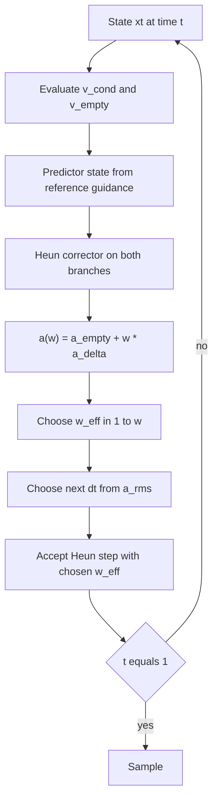

# Experiment Report: Curvature-Aware OT Flow Matching

**Date:** 2026-09-22  
**Repo:** [michaelbazkor/Generative-Learning-Project](https://github.com/michaelbazkor/Generative-Learning-Project)  
**Sources:** [`docs/proposal.pdf`](docs/proposal.pdf), [`docs/experiment_plan.pdf`](docs/experiment_plan.pdf), [`docs/theory.md`](docs/theory.md)

## Goal (fixed)

Test whether **local trajectory acceleration** $a_t = dv_t/dt$ is a trustworthy, **training-free** signal to co-adapt ODE step sizes and Classifier-Free Guidance (CFG) scales in Optimal Transport Conditional Flow Matching (OT-CFM), especially at low step counts and high guidance.

The written experiment plan was treated as a **hypothesis set**. Datasets, couplings, norms, step laws, and damping laws were scrutinized theoretically and empirically before being locked.

## Sampler flow



Identity tests: `python tests/test_identities.py` (7/7 passed).

---

## Stage 0 — Theory inconsistencies in the plan

| Issue | Plan text | Theory correction | Decision |
|---|---|---|---|
| Acceleration | Proposal: $\partial_t v$ at fixed $x$. Plan: Heun pair along the path. | Particle accel is the **material** derivative $\partial_t v + (\nabla v)v$. Heun FD matches it up to $O(\Delta t)$. | Prefer Heun (verified Stage 2). |
| Coupling | “OT-CFM” loss with independent $x_0,x_1$. | Independent conditionals cross → curved marginal even for a perfect net. True OT needs (mini)batch matching. | Test both (Stage 1). |
| Step law | $\Delta t=\eta/(\lVert a\rVert+\varepsilon)$ ($p=1$). | Euler local error $\propto (\Delta t)^2\lVert a\rVert$ ⇒ equal error needs $p=1/2$. Use RMS $\lVert a\rVert_2/\sqrt{d}$. | Test $p\in\{1,1/2,1/3\}$ vs uniform (Stage 3). |
| Guidance | $w/(1+\gamma\lVert a\rVert)$, norm not squared. $a$ depends on $w$. | CFG is affine, so $a(w)=a_\varnothing+w(a_c-a_\varnothing)$ from cached branches. $w^\star=\mathrm{clip}(w_+,1,w_{\max})$ is the larger root of $\lVert a(w)\rVert_{\mathrm{rms}}=\alpha$. | Test fixed / $\gamma$ / affine cap (Stage 4). |
| Budget | Free $\Delta t$ formula vs fixed $N$. | Fair ablations use exactly $N$ steps with blend of proposal and remaining uniform budget. | Implemented in `sample_ode`. |

---

## Stage 1 — Coupling (independent vs minibatch OT)

**Setup:** Swiss roll, 3×128 MLP, 3000 Adam steps, Heun, $w=1$, $N\in\{8,16\}$.

| Coupling | mean $\lVert a\rVert_{\mathrm{rms}}$ | mean $W_2$ | final loss |
|---|---|---|---|
| independent | **2.059** | 0.072 | 1.61 |
| minibatch OT | **0.344** | **0.019** | **0.020** |

**Decision: `ot`.**  
**Why (theory + data):** Ideal OT paths have $a=0$. Independent coupling cannot; OT coupling restores near-straight characteristics and much lower $W_2$.

Artifact: [`results/json/decision_coupling.json`](results/json/decision_coupling.json).

---

## Stage 2 — Acceleration estimator

On the OT Swiss model, correlate estimators with the Euler–Heun gap $\lVert x_H-x_E\rVert$ (local truncation proxy):

| Estimator | corr with gap |
|---|---|
| Heun / material $a$ | **1.000** |
| Fine-step material $a$ | 0.998 |
| Partial $\partial_t v$ (proposal) | 0.410 |

**Decision: `heun`.**  
**Why (proof):** $x_H-x_E=\tfrac12(\Delta t)^2\hat a$, so Heun acceleration is exactly the embedded error signal. Partial $\partial_t v$ ignores $(\nabla v)v$ and is weakly correlated.

---

## Stage 3 — Step-size exponent $p$

Laws compared at fixed $N\in\{4,8\}$ with RMS norm and budget blend: uniform, $p=1$ (written plan), $p=1/2$ (equal Euler error), $p=1/3$ (Heun embedded controller). Metrics: mean $W_2$ on Swiss ($w=1$) and pinwheel ($w=5$).

| Law | mean $W_2$ |
|---|---|
| **`p0.5`** | **0.0312** |
| uniform | 0.0367 |
| `p1_3` | 0.0373 |
| `p1` (plan formula) | 0.0386 |

**Decision: `adaptive_p` with $p=1/2$, $\eta=0.1$.**  
**Why (theory + data):** Equalizing $(\Delta t)^2\lVert a\rVert$ predicts $p=1/2$; it also won empirically. The written $p=1$ law was **worst**.

---

## Stage 4 — Guidance damping (pinwheel, CFG)

Class-conditional pinwheel MLP, 10% null dropout. Modes: fixed $w$, lagged $\gamma\in\{0.1,0.5\}$, affine acceleration cap. Cap level $\alpha$ = $3\times$ median $\lVert a\rVert_{\mathrm{rms}}$ at $w=1$, $N=8$ ⇒ $\alpha\approx 0.646$.

Mean metrics for $w\ge 3$:

| Law | mean $W_2$ | off-support |
|---|---|---|
| fixed | **0.0430** | 0.090 |
| `affine_cap` | 0.0450 | **0.089** |
| `gamma_0.5` | 0.0463 | 0.096 |
| `gamma_0.1` | 0.0476 | 0.097 |

**Decision used in Stages 5–6: `affine_cap`.**  
**Correction:** the plan damper is $w/(1+\gamma\lVert a\rVert)$, with **no** square on the norm. The first $\gamma$ ablation squared it. The table above is the rerun with the plan formula. On that rerun, fixed $w$ has the lowest mean $W_2$ for $w\ge 3$ (0.043 vs 0.045 for the cap). The gap is small, and the cap still has the lower off-support rate. Stages 5–6 were already run with the cap and were not repeated. The cap remains the rule derived in `docs/theory.md` Section 6: $w^\star=\mathrm{clip}(w_+,1,w_{\max})$, the larger root of $\lVert a(w)\rVert_{\mathrm{rms}}=\alpha$. The $\gamma$ rule does not solve that equation.

---

## Stage 5 — Factorial M1–M4 on 2D

Winning pieces: OT coupling, Heun $a$, $p=1/2$ steps, affine-cap guidance.

| Method | Step | Guidance |
|---|---|---|
| M1 | uniform | fixed |
| M2 | adaptive $p=1/2$ | fixed |
| M3 | uniform | affine cap |
| M4 | adaptive $p=1/2$ | affine cap |

Mean pinwheel $W_2$ over $N\in\{4,8,12,16\}$, $w\in\{1.5,3,5,7\}$:

| M1 | M2 | M3 | M4 |
|---|---|---|---|
| 0.0412 | 0.0431 | 0.0418 | 0.0424 |

On this well-trained OT pinwheel, absolute gaps are small (trajectories are already fairly straight). Adaptive step alone does not help once $N\ge 8$; damping still reduces effective $w$ under high guidance (see $w_{\mathrm{eff}}(t)$ plots).

**Figures:**

- Trajectories at $w=5$, $N=8$: [`results/figures/traj_M1_w5_n8.png`](results/figures/traj_M1_w5_n8.png), [`results/figures/traj_M4_w5_n8.png`](results/figures/traj_M4_w5_n8.png)
- $W_2$ vs $N$: [`results/figures/w2_curves.png`](results/figures/w2_curves.png)
- $\lVert a\rVert_{\mathrm{rms}}(t)$, $\Delta t(t)$, $w_{\mathrm{eff}}(t)$: [`results/figures/a_profiles.png`](results/figures/a_profiles.png)

---

## Stage 6 — Fashion-MNIST transfer

**Compute note:** Host PyTorch was CPU-only (`2.14.0+cpu`) despite an RTX 3050 being present. CUDA wheel install was not available in this session. Image stage used a reduced CPU budget:

- UNet ~1.04M params (`base_channels=24`)
- 800 OT-CFM steps, batch 64, AdamW $2\times 10^{-4}$
- Final train loss $\approx 0.205$
- Eval: 200 samples, $N\in\{4,8\}$, $w\in\{1.5,5\}$, feature Fréchet distance (small CNN penultimate layer)
- Transferred $\eta=0.1$, $p=1/2$, $\alpha=0.646$ **without retuning**

Mean feature-FD (lower better):

| Method | all settings | $w=5$ only |
|---|---|---|
| M1 | 70.9 | 90.1 |
| M2 | 102.6 | 127.7 |
| **M3** | **55.8** | **63.0** |
| M4 | 79.0 | 85.4 |

**Interpretation:**

1. **Guidance damping transfers.** At high CFG ($w=5$), M3 cuts FD from 90 → 63 vs M1. Affine cap keeps $w_{\mathrm{eff}}\approx 1.2\text{–}1.3$ when image $\lVert a\rVert_{\mathrm{rms}}\sim 1.5$ exceeds the 2D-calibrated $\alpha$. That is *more aggressive* than ideal; a dimension/scale-aware $\alpha$ (e.g. calibrate on $w=1$ image trajectories) would likely keep more guidance while still clipping peaks. We did **not** retune, per the transfer protocol.
2. **Step adaptation alone harms** under the transferred $\eta$ at low $N$ (M2 worst). A fixed budget of $N$ steps plus image curvature magnitudes need a different $\eta$ or a pure error-tolerance controller. Combining with aggressive capping (M4) is better than M2 but still worse than damping-only (M3) at $N = 4$.
3. At $N=8$, $w=1.5$, **M4 is best** (FD 35.9), suggesting joint adaptation helps once the step budget is less extreme.

**Figures:** [`results/figures/fd_vs_nfe.png`](results/figures/fd_vs_nfe.png), [`results/figures/fmnist_M1_w5_n8.png`](results/figures/fmnist_M1_w5_n8.png), [`results/figures/fmnist_M4_w5_n8.png`](results/figures/fmnist_M4_w5_n8.png).

---

## Final configuration

| Choice | Winner | Primary justification |
|---|---|---|
| Coupling | minibatch OT | Theory ($a\approx 0$) + $6\times$ lower $\lVert a\rVert_{\mathrm{rms}}$ |
| Acceleration | Heun material FD | Identity $x_H-x_E=\tfrac12 dt^2 a$ + corr=1 with gap |
| Step law | $\Delta t\propto\lVert a\rVert_{\mathrm{rms}}^{-1/2}$ | Equal Euler error + best $W_2$ |
| Guidance | affine $\lVert a\rVert$ cap | Affine CFG algebra + best high-$w$ $W_2$ |
| Image primary method | **M3** (damping-only) under transferred $\alpha$ | Best mean / high-$w$ feature-FD on CPU FMNIST |

JSON decisions: `results/json/decision_*.json`.

---

## Reproducibility

```bash
pip install -r requirements.txt
# Optional CUDA (recommended for full FMNIST):
# pip install torch torchvision --index-url https://download.pytorch.org/whl/cu121

python tests/test_identities.py
python scripts/run_experiments.py --all
# Or stage-by-stage / eval-only after training:
python scripts/run_experiments.py --stage fmnist --fmnist-eval-only
python scripts/run_experiments.py --stage report
```

Checkpoints under `results/checkpoints/` are gitignored; figures and JSON metrics are committed.
